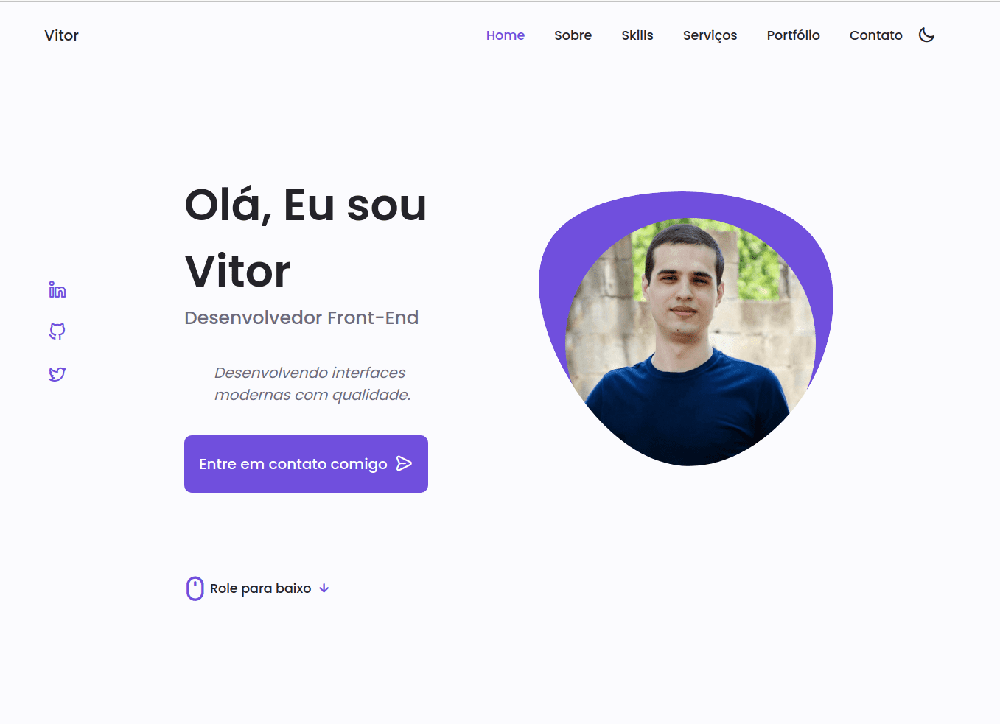

# Personal Portfolio

> Vitor Galeti's personal website.

[](https://devvitorgaletti.netlify.app/)

[](https://app.netlify.com/sites/devvitorgaletti/deploys)

## Development

---

### Prerequisites

- Install [Node.js](https://nodejs.org)

- Install [Yarn](https://yarnpkg.com/)

### Clone the repo

```bash
$ git clone https://github.com/vitorgaletti/personal-porfolio.git
```

### Run project

```bash
# Change into directory
$ cd personal-portfolio/

# Run
$ yarn start
```

- Install dependencies

```bash
$ yarn
```

- Run scripts

|        Action        |    Usage     |
| :------------------: | :----------: |
|  Start development   | `yarn start` |
| Build for production | `yarn build` |

## Author

---

[Vitor Galeti](https://devvitorgaletti.netlify.app/ 'Website')
